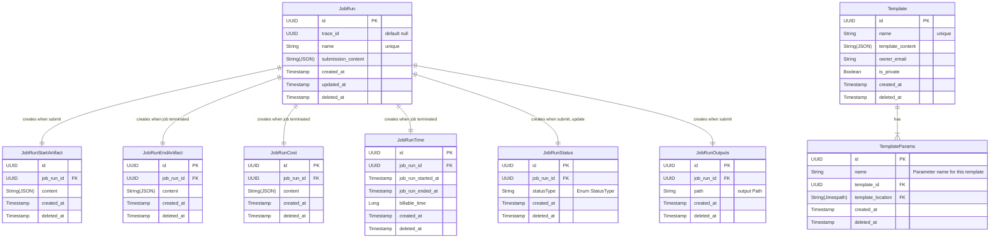

```mermaid
erDiagram
JobRun {
	UUID id PK
	UUID trace_id "default null"
	String name "unique"
	String(JSON) submission_content
	Timestamp created_at
	Timestamp updated_at
	Timestamp deleted_at
}

JobRunStartArtifact {
	UUID id
	UUID job_run_id FK
	String(JSON) content
	Timestamp created_at
	Timestamp deleted_at
}

JobRunEndArtifact {
	UUID id PK
	UUID job_run_id FK
	String(JSON) content
	Timestamp created_at
	Timestamp deleted_at
}

JobRunOutputs {
	UUID id PK
	UUID job_run_id FK
	String path "output Path"
	Timestamp created_at
	Timestamp deleted_at
}

JobRunTime {
	UUID id PK
	UUID job_run_id FK
	Timestamp job_run_started_at
	Timestamp job_run_ended_at
	Long billable_time
	Timestamp created_at
	Timestamp deleted_at
}

JobRunCost {
	UUID id PK
	UUID job_run_id FK
	String(JSON) content
	Timestamp created_at
	Timestamp deleted_at
}

JobRunStatus {
	UUID id PK
	UUID job_run_id FK
	String statusType "Enum StatusType"
	Timestamp created_at
	Timestamp deleted_at
}

Template {
	UUID id PK
	String name "unique"
	String(JSON) template_content
	String owner_email
	Boolean is_private
	Timestamp created_at
	Timestamp deleted_at
}

TemplateParams {
	UUID id PK
	String name "Parameter name for this template"
	UUID template_id FK
	String(Jmespath) template_location FK
	
	Timestamp created_at
	Timestamp deleted_at
}

JobRun ||--|| JobRunStartArtifact : "creates when submit"
JobRun ||--|| JobRunEndArtifact : "creates when job terminated"
JobRun ||--|| JobRunCost : "creates when job terminated"
JobRun ||--|| JobRunTime : "creates when job terminated"
JobRun ||--|| JobRunStatus : "creates when submit, update"
JobRun ||--|| JobRunOutputs : "creates when submit"
Template ||--|{ TemplateParams: "has"
```
