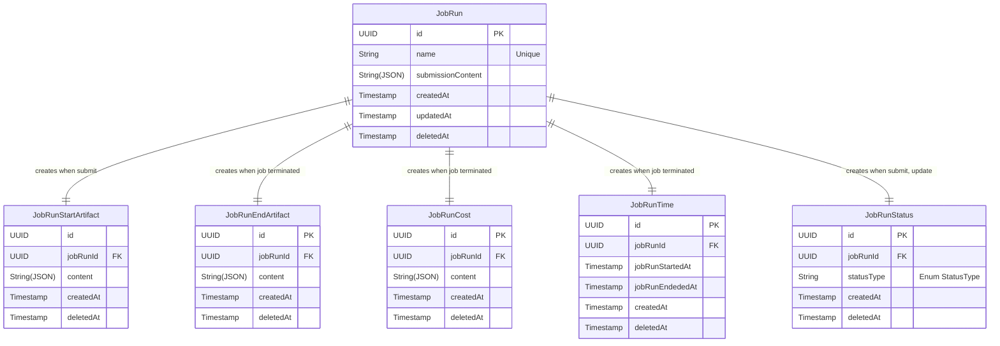

```mermaid
erDiagram
JobRun {
	UUID id PK
	String name "Unique"
	String(JSON) submissionContent
	Timestamp createdAt
	Timestamp updatedAt
	Timestamp deletedAt
}

JobRunStartArtifact {
	UUID id
	UUID jobRunId FK
	String(JSON) content
	Timestamp createdAt
	Timestamp deletedAt
}

JobRunEndArtifact {
	UUID id PK
	UUID jobRunId FK
	String(JSON) content
	Timestamp createdAt
	Timestamp deletedAt
}

JobRunTime {
	UUID id PK
	UUID jobRunId FK
	Timestamp jobRunStartedAt
	Timestamp jobRunEndededAt
	Timestamp createdAt
	Timestamp deletedAt
}

JobRunCost {
	UUID id PK
	UUID jobRunId FK
	String(JSON) content
	Timestamp createdAt
	Timestamp deletedAt
}

JobRunStatus {
	UUID id PK
	UUID jobRunId FK
	String statusType "Enum StatusType"
	Timestamp createdAt
	Timestamp deletedAt
}

JobRun ||--|| JobRunStartArtifact : "creates when submit"
JobRun ||--|| JobRunEndArtifact : "creates when job terminated"
JobRun ||--|| JobRunCost : "creates when job terminated"
JobRun ||--|| JobRunTime : "creates when job terminated"
JobRun ||--|| JobRunStatus : "creates when submit, update"
```
