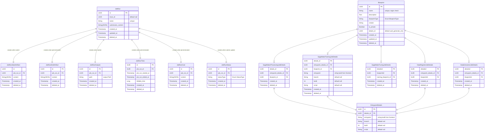

```mermaid
erDiagram
JobRun {
	UUID id PK
	UUID trace_id "default null"
	String name "unique"
	String(JSON) submission_content
	Timestamp created_at
	Timestamp updated_at
	Timestamp deleted_at
}

JobRunStartArtifact {
	UUID id
	UUID job_run_id FK
	String(JSON) content
	Timestamp created_at
	Timestamp deleted_at
}

JobRunEndArtifact {
	UUID id PK
	UUID job_run_id FK
	String(JSON) content
	Timestamp created_at
	Timestamp deleted_at
}

JobRunOutputs {
	UUID id PK
	UUID job_run_id FK
	String path "output Path"
	Timestamp created_at
	Timestamp deleted_at
}

JobRunTime {
	UUID id PK
	UUID job_run_id FK
	Timestamp job_run_started_at
	Timestamp job_run_ended_at
	Long billable_time
	Timestamp created_at
	Timestamp deleted_at
}

JobRunCost {
	UUID id PK
	UUID job_run_id FK
	String(JSON) content
	Timestamp created_at
	Timestamp deleted_at
}

JobRunStatus {
	UUID id PK
	UUID job_run_id FK
	String statusType "Enum StatusType"
	Timestamp created_at
	Timestamp deleted_at
}

Blueprint {
	UUID id PK
	String name "unique, regex check"
	Text description
	String blueprintType "Enum BlueprintType"
	String creator
	Boolean is_private
	UUID details_id "default uuid_generate_v4()"
	Timestamp created_at
	Timestamp updated_at
	Timestamp deleted_at
}

EntrypointDetails {
	UUID id PK
	UUID details_id FK
	String entrypoint "string build from frontend"
	String branch "default null"
	int build "default null"
	String script "default null"
}

SageMakerProcessingJobDetails {
	UUID details_id PK
	UUID entrypoint_details_id FK
	UUID blueprint_id FK
	Timestamp created_at
	Timestamp deleted_at
}

SageMakeTrainingJobDetails {
	UUID details_id PK
	UUID entrypoint_details_id FK
	UUID blueprint_id FK
	String entrypoint "string build from frontend"
	String branch "default null"
	int build "default null"
	String script "default null"
	Timestamp created_at
	Timestamp deleted_at
}

SageMakeTuningJobDetails {
	UUID detailsid PK
	UUID blueprintId FK
	UUID training_blueprint_id FK
	Timestamp created_at
	Timestamp deleted_at
}

DataRegisterJobDetails {
	UUID detailsid PK
	UUID entrypoint_details_id FK
	UUID blueprintId FK
	Timestamp created_at
	Timestamp deleted_at
}

DataExtractionJobDetails {
	UUID detailsid PK
	UUID entrypoint_details_id FK
	UUID blueprintId FK
	Timestamp created_at
	Timestamp deleted_at
}

JobRun ||--|| JobRunStartArtifact : "creates when submit"
JobRun ||--|| JobRunEndArtifact : "creates when job terminated"
JobRun ||--|| JobRunCost : "creates when job terminated"
JobRun ||--|| JobRunTime : "creates when job terminated"
JobRun ||--|| JobRunStatus : "creates when submit, update"
JobRun ||--|| JobRunOutputs : "creates when submit"
Blueprint || -- o| SageMakerProcessingJobDetails: ""
Blueprint || -- o| SageMakeTrainingJobDetails: ""
Blueprint || -- o| SageMakeTuningJobDetails: ""
Blueprint || -- o| DataRegisterJobDetails: ""
Blueprint || -- o| DataExtractionJobDetails: ""
SageMakerProcessingJobDetails || -- || EntrypointDetails: ""
SageMakeTrainingJobDetails || -- || EntrypointDetails: ""
DataRegisterJobDetails || -- || EntrypointDetails: ""
DataExtractionJobDetails || -- || EntrypointDetails: ""
```
